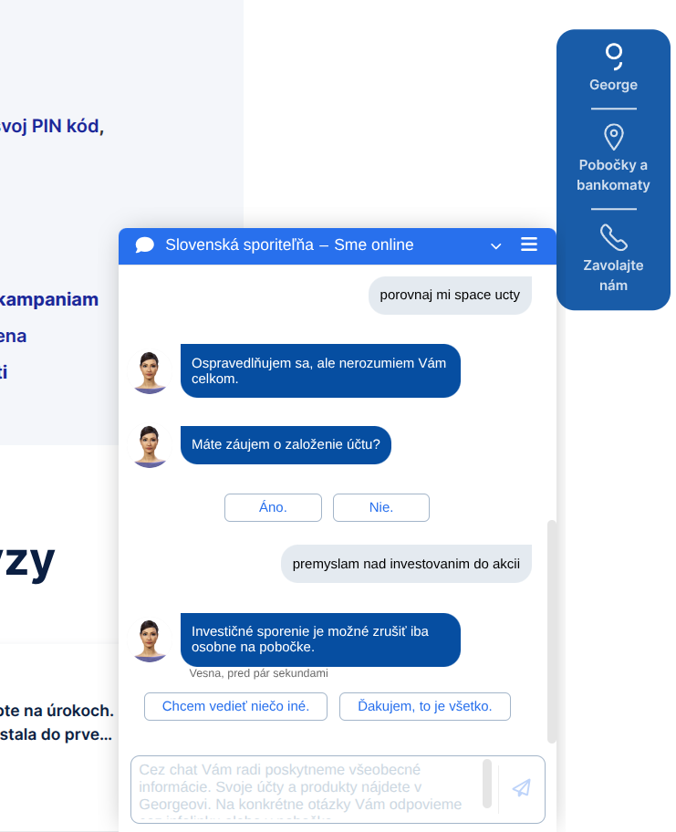
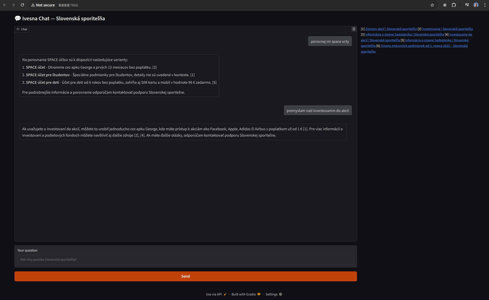

# Ivesna Chatbot

Ivesna is a FastAPI-based chatbot platform that uses a Scrapy-powered crawler to ingest approved business website content and an OpenAI-powered language model to answer user queries with high accuracy.  
It improves upon the original **Vesna** chatbot, which relied on hardcoded rules and deterministic responses.

## Features
- **Automated Website Crawling** — Scrapy-based crawler fetches and cleans content from approved domains.
- **OpenAI Integration** — Generates natural and contextually relevant answers from retrieved knowledge.
- **Multi-Tenant Support** — Handle multiple business knowledge bases.
- **Flexible Frontends** — Works with Gradio or React UI.
- **Citations** — Provides clickable references for transparency.

## How It Works
1. Crawl and store website content with embeddings.
2. Retrieve relevant context from the vector database for a given user query.
3. Generate a response using an OpenAI LLM with the context.
4. Display the answer and citations in the frontend.

## Comparison

### Original Vesna Chatbot (Rule-Based)
The original Vesna chatbot relied on predefined rules and deterministic answers, which often failed to provide relevant information for new or complex queries.



### Ivesna Chatbot (LLM-Powered)
The new Ivesna chatbot uses OpenAI’s LLM to dynamically understand and respond to user questions, retrieving precise information from the ingested knowledge base.



## Running Locally

### Backend
```bash
# Install dependencies
pip install -r requirements.txt

# Run FastAPI app
uvicorn app.main:app --reload
```

### Frontend (Gradio)
```bash
pip install gradio requests
python gradio_app.py
```

## API Example
```bash
curl -X POST "http://127.0.0.1:8000/v1/chat" \
  -H "Content-Type: application/json" \
  -d '{ 
    "tenant": "slsp", 
    "message": "Aké účty ponúka Slovenská sporiteľňa?" 
  }'
```

---
© 2025 Ivesna Project
